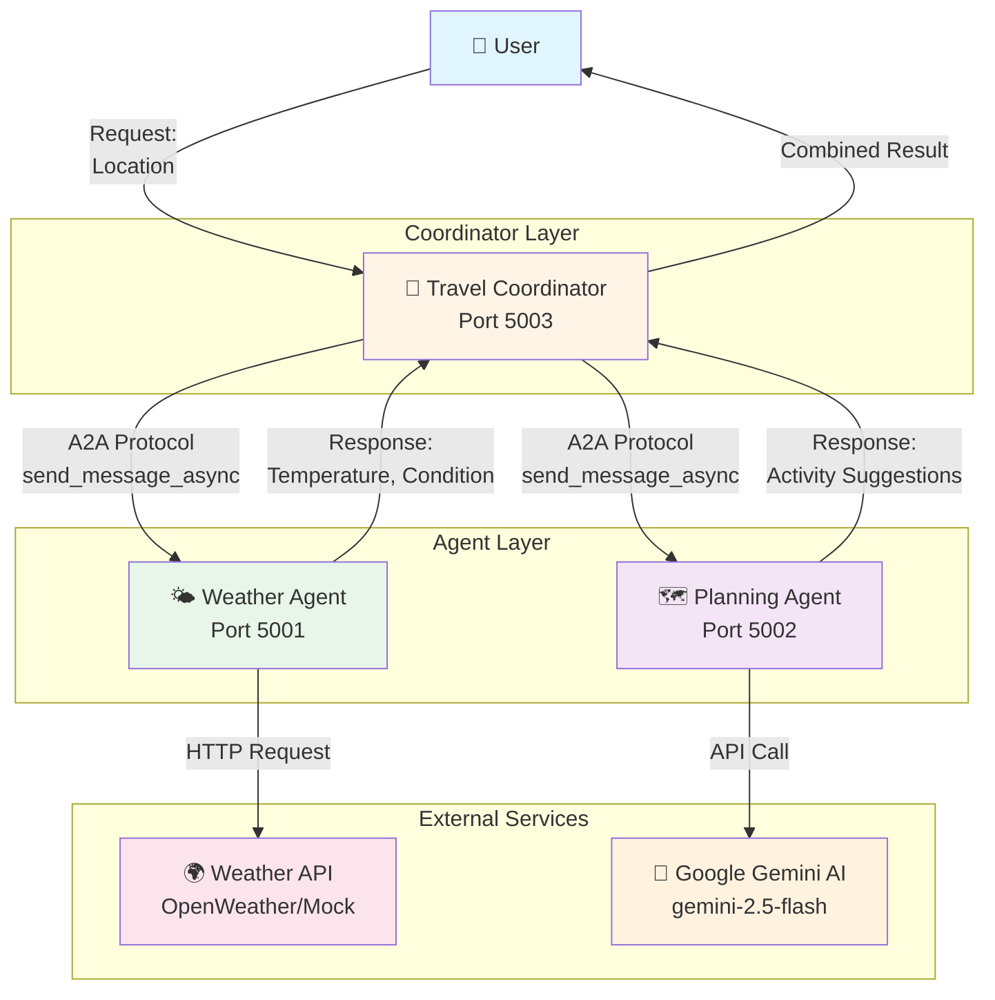
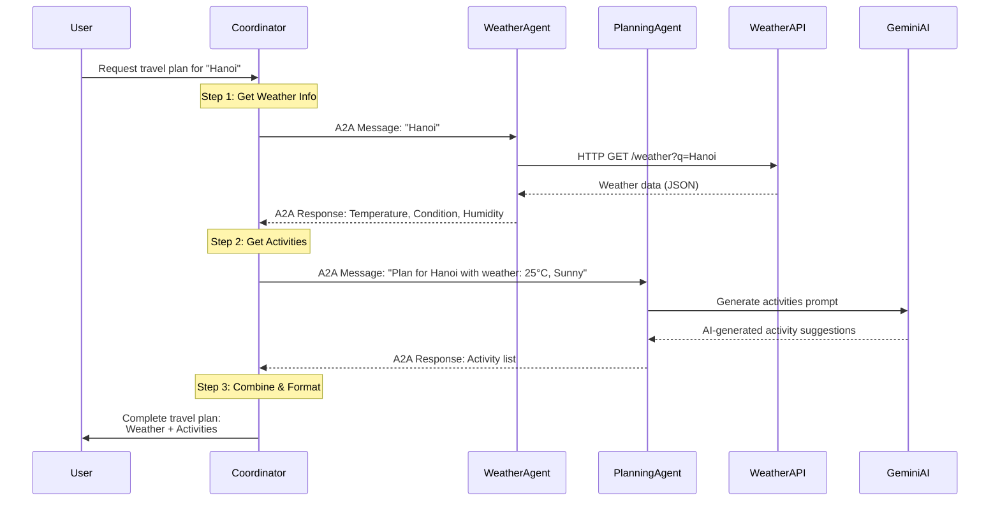
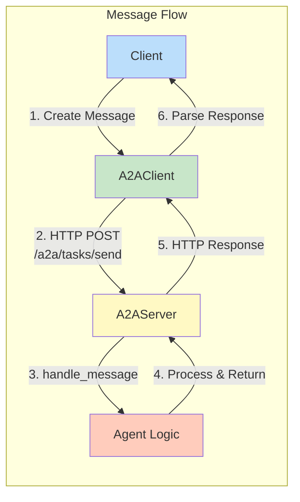

# 🌏 A2A Travel Planning System

Multi-Agent Travel Planning System using Agent-to-Agent (A2A) Protocol

## 🚀 Quick Start

### 1. Cài đặt dependencies
```bash
uv sync
```

### 2. Cấu hình environment
Copy `.env.example` thành `.env` và điền API keys:
```bash
cp .env.example .env
```

Chỉnh sửa `.env`:
```env
GEMINI_API_KEY=your_gemini_api_key_here
```

### 3. Chạy agents

**Terminal 1 - Weather Agent:**
```bash
uv run python -m agents.weather.agent
```

**Terminal 2 - Planning Agent:**
```bash
uv run python -m agents.planning.agent
```

**Terminal 3 - Coordinator:**
```bash
uv run python -m agents.coordinator.agent
```

Hoặc test với địa điểm tùy chỉnh:
```bash
uv run python -m agents.coordinator.agent "Paris" "Tokyo" "New York"
```

---

## 🧪 Testing với cURL

### Test Weather Agent (Port 5001)

**Lấy metadata:**
```bash
curl http://localhost:5001/a2a/.well-known/agent.json
```

**Lấy thời tiết:**
```bash
curl -X POST http://localhost:5001/a2a/tasks/send \
  -H "Content-Type: application/json" \
  -d '{
    "message": {
      "role": "user",
      "content": {
        "type": "text",
        "text": "Hanoi"
      }
    }
  }'
```

### Test Planning Agent (Port 5002)

**Lấy metadata:**
```bash
curl http://localhost:5002/a2a/.well-known/agent.json
```

**Lấy activity suggestions:**
```bash
curl -X POST http://localhost:5002/a2a/tasks/send \
  -H "Content-Type: application/json" \
  -d '{
    "message": {
      "role": "user",
      "content": {
        "type": "text",
        "text": "Plan for Da Nang with weather: Temperature: 28°C, Condition: Sunny, Humidity: 70%"
      }
    }
  }'
```

### Hoặc dùng test scripts

```bash
# Test tất cả agents
bash test_agents.sh

# Test riêng Weather Agent
bash test_weather.sh

# Test riêng Planning Agent với nhiều scenarios
bash test_planning.sh
```

---

## 📋 Kiến trúc hệ thống

### 🏗️ System Architecture



### 🔄 Workflow Sequence



### 🔌 A2A Protocol Communication


