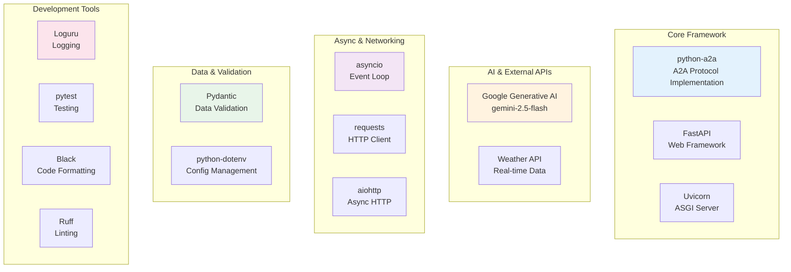
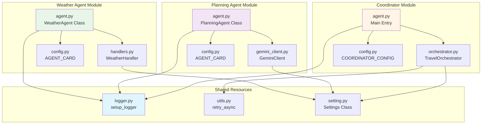

# 🌏 A2A Travel Planning System

Multi-Agent Travel Planning System using Agent-to-Agent (A2A) Protocol

## 🚀 Quick Start

### 1. Cài đặt dependencies
```bash
uv sync
```

### 2. Cấu hình environment
Copy `.env.example` thành `.env` và điền API keys:
```bash
cp .env.example .env
```

Chỉnh sửa `.env`:
```env
GEMINI_API_KEY=your_gemini_api_key_here
```

### 3. Chạy agents

**Terminal 1 - Weather Agent:**
```bash
uv run python -m agents.weather.agent
```

**Terminal 2 - Planning Agent:**
```bash
uv run python -m agents.planning.agent
```

**Terminal 3 - Coordinator:**
```bash
uv run python -m agents.coordinator.agent
```

Hoặc test với địa điểm tùy chỉnh:
```bash
uv run python -m agents.coordinator.agent "Paris" "Tokyo" "New York"
```

---

## 🧪 Testing với cURL

### Test Weather Agent (Port 5001)

**Lấy metadata:**
```bash
curl http://localhost:5001/a2a/.well-known/agent.json
```

**Lấy thời tiết:**
```bash
curl -X POST http://localhost:5001/a2a/tasks/send \
  -H "Content-Type: application/json" \
  -d '{
    "message": {
      "role": "user",
      "content": {
        "type": "text",
        "text": "Hanoi"
      }
    }
  }'
```

### Test Planning Agent (Port 5002)

**Lấy metadata:**
```bash
curl http://localhost:5002/a2a/.well-known/agent.json
```

**Lấy activity suggestions:**
```bash
curl -X POST http://localhost:5002/a2a/tasks/send \
  -H "Content-Type: application/json" \
  -d '{
    "message": {
      "role": "user",
      "content": {
        "type": "text",
        "text": "Plan for Da Nang with weather: Temperature: 28°C, Condition: Sunny, Humidity: 70%"
      }
    }
  }'
```

### Hoặc dùng test scripts

```bash
# Test tất cả agents
bash test_agents.sh

# Test riêng Weather Agent
bash test_weather.sh

# Test riêng Planning Agent với nhiều scenarios
bash test_planning.sh
```

---

## 📋 Kiến trúc hệ thống

### 🏗️ System Architecture

```mermaid
graph TB
    User[👤 User]
    
    subgraph "Coordinator Layer"
        Coord[🎯 Travel Coordinator<br/>Port 5003]
    end
    
    subgraph "Agent Layer"
        Weather[🌤️ Weather Agent<br/>Port 5001]
        Planning[🗺️ Planning Agent<br/>Port 5002]
    end
    
    subgraph "External Services"
        WeatherAPI[🌍 Weather API<br/>OpenWeather/Mock]
        Gemini[🤖 Google Gemini AI<br/>gemini-2.5-flash]
    end
    
    User -->|"Request:<br/>Location"| Coord
    Coord -->|"A2A Protocol<br/>send_message_async"| Weather
    Coord -->|"A2A Protocol<br/>send_message_async"| Planning
    Weather -->|"HTTP Request"| WeatherAPI
    Planning -->|"API Call"| Gemini
    
    Weather -->|"Response:<br/>Temperature, Condition"| Coord
    Planning -->|"Response:<br/>Activity Suggestions"| Coord
    Coord -->|"Combined Result"| User
    
    style User fill:#e1f5ff
    style Coord fill:#fff4e6
    style Weather fill:#e8f5e9
    style Planning fill:#f3e5f5
    style WeatherAPI fill:#fce4ec
    style Gemini fill:#fff3e0
```



### 🔄 Workflow Sequence

```mermaid
sequenceDiagram
    participant User
    participant Coordinator
    participant WeatherAgent
    participant PlanningAgent
    participant WeatherAPI
    participant GeminiAI

    User->>Coordinator: Request travel plan for "Hanoi"
    
    Note over Coordinator: Step 1: Get Weather Info
    Coordinator->>WeatherAgent: A2A Message: "Hanoi"
    WeatherAgent->>WeatherAPI: HTTP GET /weather?q=Hanoi
    WeatherAPI-->>WeatherAgent: Weather data (JSON)
    WeatherAgent-->>Coordinator: A2A Response: Temperature, Condition, Humidity
    
    Note over Coordinator: Step 2: Get Activities
    Coordinator->>PlanningAgent: A2A Message: "Plan for Hanoi with weather: 25°C, Sunny"
    PlanningAgent->>GeminiAI: Generate activities prompt
    GeminiAI-->>PlanningAgent: AI-generated activity suggestions
    PlanningAgent-->>Coordinator: A2A Response: Activity list
    
    Note over Coordinator: Step 3: Combine & Format
    Coordinator->>User: Complete travel plan:<br/>Weather + Activities
```



### 🔌 A2A Protocol Communication


### 🛠️ Technology Stack



### 📦 Component Interaction



---

## 🛠️ Công nghệ

- **python-a2a** - Agent-to-Agent protocol implementation
- **Google Gemini AI** - Activity planning (gemini-2.5-flash)
- **FastAPI** - Modern async web framework
- **Uvicorn** - Lightning-fast ASGI server
- **Loguru** - Beautiful logging
- **Pydantic** - Data validation
- **asyncio** - Async operations
- **requests** - HTTP client

---

## 📁 Project Structure

```
a2a-protocal/
├── agents/
│   ├── weather/          # Weather Agent
│   ├── planning/         # Planning Agent (Gemini)
│   └── coordinator/      # Orchestrator
├── config/
│   └── setting.py        # Configuration
├── shared/
│   ├── logger.py         # Logging setup
│   └── utils.py          # Utilities
├── test_agents.sh        # Test all agents
├── test_weather.sh       # Test weather agent
└── test_planning.sh      # Test planning agent
```

---

## 🎯 Agents

### 🌤️ Weather Agent (Port 5001)
Provides real-time weather information

**Input:** Location name  
**Output:** Temperature, condition, humidity

### 🗺️ Planning Agent (Port 5002)
AI-powered activity suggestions using Google Gemini

**Input:** Location + weather info  
**Output:** Personalized activity recommendations

### 🎯 Coordinator (Port 5003)
Orchestrates the complete workflow

**Input:** Location(s)  
**Output:** Complete travel plan with weather + activities

---

## 🔧 Development

### Run tests
```bash
uv run pytest
```

### Format code
```bash
uv run black .
```

### Lint
```bash
uv run ruff check .
```

### Type check
```bash
uv run mypy .
```

---

## 📝 License

MIT

---

## 👨‍💻 Author

Your Name

---

## 🙏 Acknowledgments

- [python-a2a](https://github.com/yourusername/python-a2a) - A2A Protocol implementation
- [Google Gemini](https://ai.google.dev/) - AI model for activity planning
